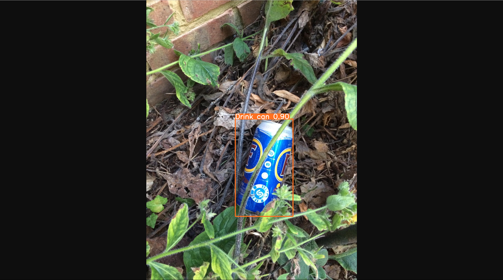

# 项目简介

此项目基于yolov5-6.2修改

使用Flask上传图片并调用 **本地模型** 推断

~~因为没找到载入本地模型的示例~~

<br>

载入模型相关可参考：

[Load YOLOv5 from PyTorch Hub ⭐ · Issue #36 · ultralytics/yolov5 (github.com)](https://github.com/ultralytics/yolov5/issues/36)

<br>

# 运行说明

## 环境配置

```bash
conda create  yolov5_flask_sample python=3.8
conda activate yolov5_flask_sample
cd ${project_dir}
pip install -r requirements.txt
```

在`requirements.txt`中注释了部分torch、torchvision与非必要module

如果在`requirements.txt`中不注释torch相关module

`pip install -r requirements.txt`会默认安装CPU版PyTorch

当然若该环境仅用于单次推断不用于训练则CPU版PyTorch足矣

使用如下命令行安装torch 1.13.1

```bash
pip install torch==1.13.1 torchvision==0.14.1 torchaudio==0.13.1
```

<br>

如果需要安装CUDA版PyTorch

可使用如下命令在线安装

```bash
# CUDA 11.6
pip install torch==1.12.1+cu116 torchvision==0.13.1+cu116 torchaudio==0.12.1 --extra-index-url https://download.pytorch.org/whl/cu116

# CUDA 11.3
pip install torch==1.12.0+cu113 torchvision==0.13.0+cu113 torchaudio==0.12.0 --extra-index-url https://download.pytorch.org/whl/cu113

# CUDA 10.2
pip install torch==1.12.1+cu102 torchvision==0.13.1+cu102 torchaudio==0.12.1 --extra-index-url https://download.pytorch.org/whl/cu102
```

或者访问如下链接下载whl

- CUDA 11.6

https://download.pytorch.org/whl/cu116

- CUDA 11.3

https://download.pytorch.org/whl/cu113

- CUDA 10.2

https://download.pytorch.org/whl/cu102

<br>

更多版本请点击如下链接阅读PyTorch官网指南

https://pytorch.org/get-started/previous-versions/

<br>

## 启动项目

```bash
cd ${project_dir}
conda activate yolov5_flask_sample
python app.py
```

启动后访问：http://localhost:5003/detect/upload


<br>

## 模型推断

选择需要被检测的图片后点击上传

模型推断完成后显示检测后的图片

检测结果保存在`static/detect_result`中

**如果该目录不存在请手动创建**


<br>

# 更换模型

此项目初衷是由于大部分yolov5项目都是调用yolov5官方的预训练权重

修改`app.py`中的`weights_path`为自定义训练的生成权重即可更换检测模型

```python
weights_path = 'weights/yolov5-7.0/yolov5s6.pt'
# weights_path = 'weights/yolov5-3.1/TACO_yolov5s_300_epochs.pt'
```

开启了debug模式修改后应该会直接生效

如果没有开启debug请重新启动web项目

之后重新上传图片可以调用自定义模型检测



<br>

# 项目结构

本项目保留了大部分yolov5-6.2原始目录结构

部分原始文件存放在backup`中

`train_util`目录下存放了自定义训练可能会用到的脚本

`dataset`目录下存放了自定义训练数据集目录结构

`utils/common_utils.py`中存放了自定义的一些工具函数

<br>

## 初始化模型

如下代码位于`app.py`中

```python
def init_model(repo_dir, model_path, source='local', device='cpu'):
    if source != 'local':
        model = torch.hub.load('ultralytics/yolov5', 'yolov5s', pretrained=True)  # force_reload = recache latest code
        return model
    model = torch.hub.load(repo_dir, 'custom', path=model_path, source=source, device=device)
    model.eval()
    return model
```

<br>

## 视图跳转

如下代码位于`blueprints/detect.py`中

```python
import datetime
import io
import os

from PIL import Image
from flask import Blueprint, request, render_template, g, redirect
from utils.backend_utils import dir_utils

bp = Blueprint(name='detect', import_name=__name__)

DATETIME_FORMAT = "%Y-%m-%d_%H-%M-%S-%f"


@bp.route("/upload", methods=["GET", "POST"])
def inference():
    model = g.model

    if request.method == "POST":
        if "file" not in request.files:
            return redirect(request.url)
        print(request)
        file = request.files["file"]
        if not file:
            return

        img_bytes = file.read()
        img = Image.open(io.BytesIO(img_bytes))
        results = model([img])

        results.render()  # updates results.imgs with boxes and labels
        now_time = datetime.datetime.now().strftime(DATETIME_FORMAT)
        img_save_name = f"static/detect_result/{now_time}.png"
        output_dir = os.path.join(g.repo_dir, 'static/detect_result')
        common_utils.create_dir(output_dir)
        Image.fromarray(results.imgs[0]).save(img_save_name)
        return redirect('/' + img_save_name)

    return render_template("index.html")
```